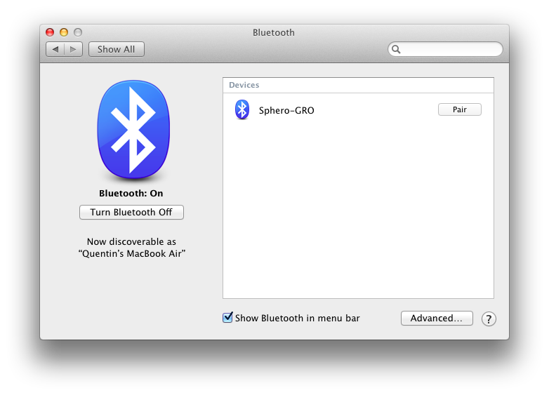
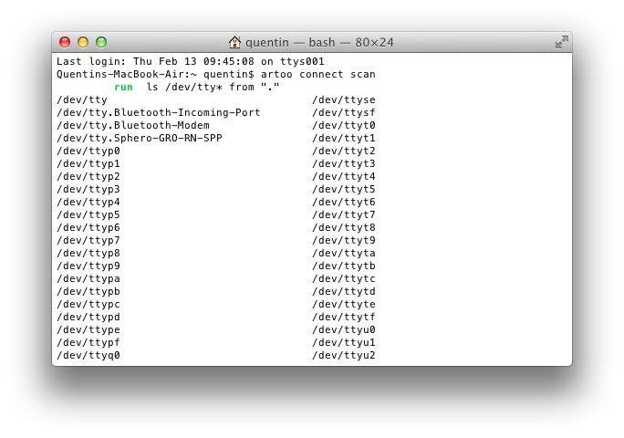
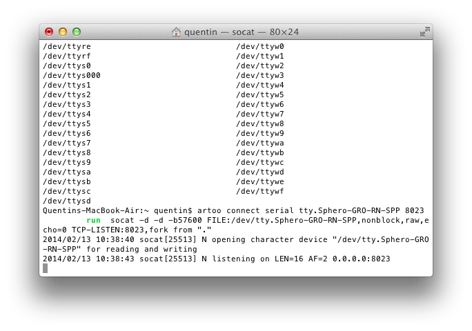
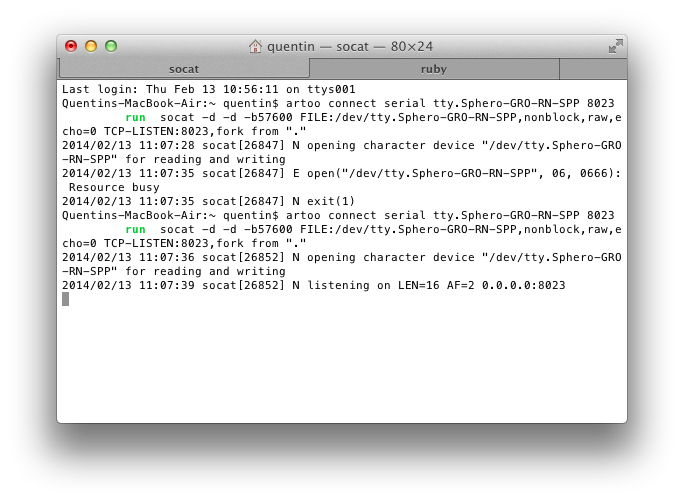
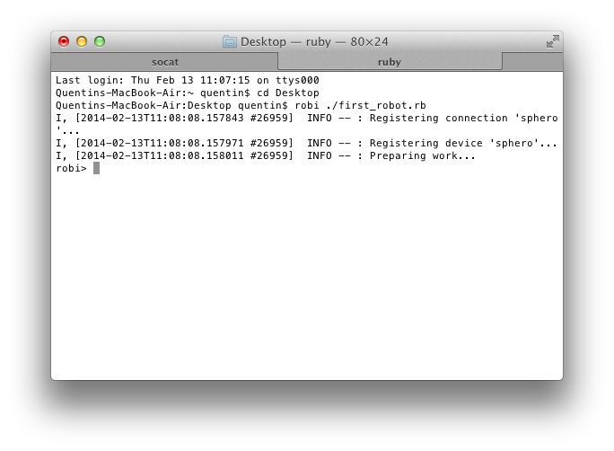

# sphero-playground

This is just a collection of useful things when writing ruby programs with [artoo](http://artoo.io) for the [sphero](http://gosphero.com) robot platform. I'm a total beginner when it comes to ruby and artoo, so hopefully other beginners will find my point of view and tutorials/examples useful when it comes to ramping up skill with these tools/toys. 

## 10 steps to Sphero on Artoo.io

Before you begin you should make sure that you have ruby installed on your system. The [artoo.io getting started](http://artoo.io/documentation/getting-started/) documentation is what you should read first. Here are the boiled-down steps:

> Note: this steps are written by someone who has a **Macbook** (OSX). If you are using Linux the steps should be similar, but I recommend you read the documentation on the artoo.io getting started page!

### 1. Install `rvm`
RVM is the "Ruby Version Manager", which makes installing and managing rubies super simple. Run this in a terminal 

    \curl -L https://get.rvm.io | bash -s stable

Close your current terminal, then open a new one; check that the installation went according to plan

	rvm -v
   
### 2. Install a ruby
From the terminal, install Ruby 2.0.0 using the ruby version manager you installed in the previous step:

	rvm install 2.0.0
	
After install is complete, make it the default version

	rvm --default use 2.0.0
	
	
### 3. Install `artoo` and `socat` gems
Again, from the terminal install the artoo gem

	gem install artoo
	
Then the socat gem, which manages your connection between artoo and the bluetooth port on your computer

	gem install socat
	
### 4. Install the `artoo-sphero` gem

	gem install artoo-sphero

Once you've installed this gem, you should be ready to *roll*. **Go ahead and close out your current terminal window** just to make sure all changes are sourced to your bash profile. (This is probably not necessary, just a habit of mine)

### 5. Connect to your Sphero
Now it's time to connect to your Sphero. Open you Macbook's bluetooth preferences, and make sure bluetooth is turned on. Tap your sphero to make sure it is ready for pairing. **If your sphero is already paired/connected to another device, you should turn that connection off**. 

If your sphero is ready to connect, you should see it in your bluetooth preferences. If your sphero is flashing *GREEN*, *RED*, *ORANGE*, you will see this:

Go ahead and pair with it! 

> Note: even after you successfully pair with your sphero and the bluetooth preferences says "Connected", your sphero will still blink it's color code - don't worry, it will glow a solid blue (as when you connect with your phone) when you initiate your first artoo robot below.

### 6. Use `artoo connect scan` 
We now need to actually connect to the sphero's bluetooth port from the terminal. Open up a new terminal and type

	artoo connect scan
	
You should see a list of all devices on your Macbook. Scroll up/down until you've located the obviously-sphero-linked devices line. Here is mine:

Thus, my sphero is located at **tty.Sphero-GRO-RN-SPP**

### 7. Connect to your sphero
Now we are going to connect to the sphero. **The result of this action is that your sphero should turn a solid blue color**. 

In your terminal

	artoo connect serial tty.Sphero-GRO-RN-SPP 8023
	
The serial port **8023** is just some random number I chose. You may pick a different number. 

If this is successful, you should see something similar to the following output, and your sphero should be glowing the solid blue color indicative of an established connection.

Take note of the connection address

	2014/02/13 10:45:42 socat[25686] N listening on LEN=16 AF=2 0.0.0.0:8023
	
You'll need to record `0.0.0.0:8023` or whatever yours is, for step 8 and below. 

#### Common error messages
Here are some of the common error messages I've recieved  after step 7 above

**Resource Busy**

	... socat[25635] ( ... ): Resource Busy
This one is actually the most common - socat doesn't retry the connection multiple times, so it's possible your connection was refused even though everything was ok (on your phone, if the connection is refused I believe it automatically will retry several times before aborting).

If you get this message, just try to connect again. It should work after a 2-3 of tries. 

If you get this message after many tries, I recommend resetting your bluetooth connection (turing it off/on), and resetting your sphero. 

**Address already in use**

	... socat[25635] ( ... ): Address already in use
	
Pick a different port number to bind your sphero too! Perhaps you are already connected to the sphero and just don't know it?

### 8. Write a Ruby Robot!

Now it's time to make our sphero do something. Let's just create a file called **first_robot.rb** and save it to the desktop. Inside that file, type this (remembering the connection address from step 7)

	require 'artoo'

	connection :sphero, :adaptor => :sphero, :port => '0.0.0.0:8023'
	device :sphero, :driver => :sphero

	work do
    	sphero.set_color(rand(255), rand(255), rand(255))
    	sphero.roll 100, 0
    	sleep 2
    	sphero.stop
	end

Save the file, and open your teminal again.

### 9. Run your robot with ROBI

You should have your terminal open, **the same terminal window that is currently connected to the sphero**. If the connection has been lost, connect to it again (step 7 above). 

#### Open a new tab
Press **command** + **t** to open a new tab in your terminal. Thus, you should have two tabs you can easily switch back and forth. The first tab is monitoring your (artoo/socat) connection through your bluetooth port

**artoo/socat tab**

And the second tab (**after you complete the next steps listed below**) will be monitoring your robot

**ruby/robi tab**

#### Navigate to the desktop
Or wherever you saved your **first_robot.rb** file

	cd Desktop

#### Enter the ROBI console

	robi ./first_robot.rb
	
If successful, you should have initiated the robi console:

	Quentins-MacBook-Air:Desktop quentin$ robi ./first_robot.rb
	I, [2014-02-13T10:57:27.694443 #25838]  INFO -- : Registering connection 'sphero'...
	I, [2014-02-13T10:57:27.694560 #25838]  INFO -- : Registering device 'sphero'...
	I, [2014-02-13T10:57:27.694597 #25838]  INFO -- : Preparing work...
	robi> 
	
#### Start your Robot!

Type `start`, press **Enter** and watch the fun happen!

### 10. Stop Robot, Destroy Connection

When you are ready to stop your robot, type `stop` from the robi command line and press **enter**. Once stopped, you can exit by typing `exit` and then **enter**.

To destroy your connection to the sphero, open the other tab in your terminal (the one where artoo is currently listening to your sphero) and simply press **control** + **c**. Your sphero should start blinking its color code again - awaiting another connection request.

	

